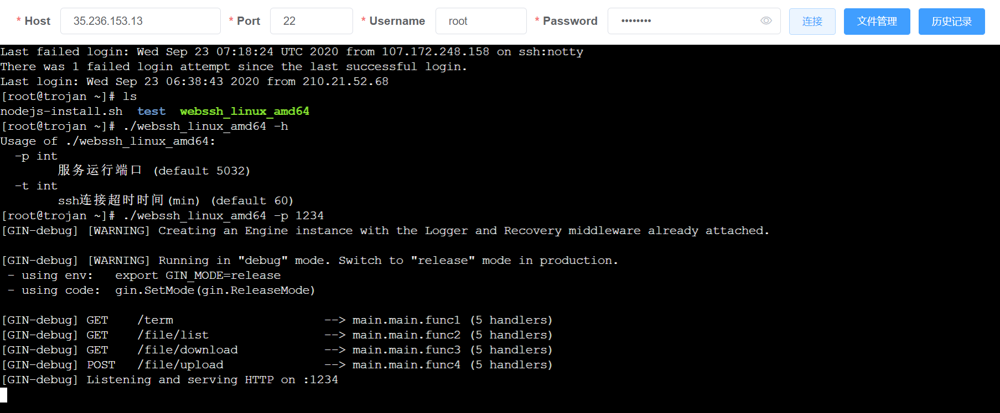
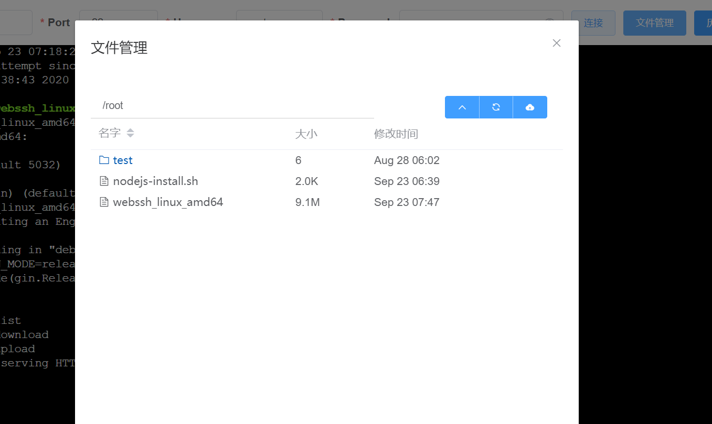

# webssh
 
 
[](https://goreportcard.com/report/github.com/Jrohy/webssh)
[](https://img.shields.io/github/downloads/Jrohy/webssh/total.svg) 
[](https://www.gnu.org/licenses/gpl-3.0.en.html)   
简易在线ssh和sftp工具, 可在线敲命令和上传下载文件

## 运行截图



## 命令行
```
Usage of ./webssh_linux_amd64:
  -a string
        开启账号密码登录验证, '-a user:pass'的格式传参
  -p int
        服务运行端口 (default 5032)
  -t int
        ssh连接超时时间(min) (default 120)
  -s    保存ssh密码
  -v    显示版本号
```

## 原理
```
+---------+     http     +--------+    ssh    +-----------+
| browser | <==========> | webssh | <=======> | ssh server|
+---------+   websocket  +--------+    ssh    +-----------+
```

## 运行
下载release里不同平台的包来执行即可

docker运行:
```
docker run -d --net=host --log-driver json-file --log-opt max-file=1 --log-opt max-size=100m --restart always --name webssh -e TZ=Asia/Shanghai -e savePass=true jrohy/webssh
```
